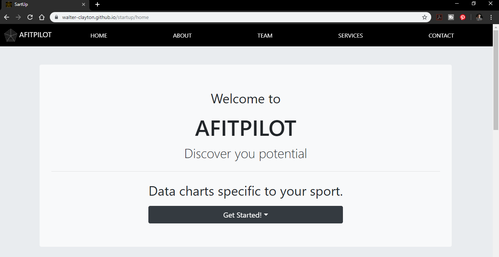

# AFITPILOT Prototype

This is an exercise to practice responsive web design with HTML5, CSS3, and Bootstrap.

Click here: [Demo](https://walter-clayton.github.io/startup/home)

## Built with

* HTML5
* CSS3
* BOOTSTRAP4
* JavaScript
* Resonsive (media queries)

## Author

* **Walter Clayton** - *startup* - [github profil](https://github.com/walter-clayton)

    * **LinkedIn account** : [LinkedIn](https://www.linkedin.com/in/walter-clayton-2b50b4191/)

## Appreciation

* Thank you to all the people who helped with this project
* [@ayoubochan](https://github.com/ayoubochan)
* Exercises from [BeCode](https://www.becode.org)

